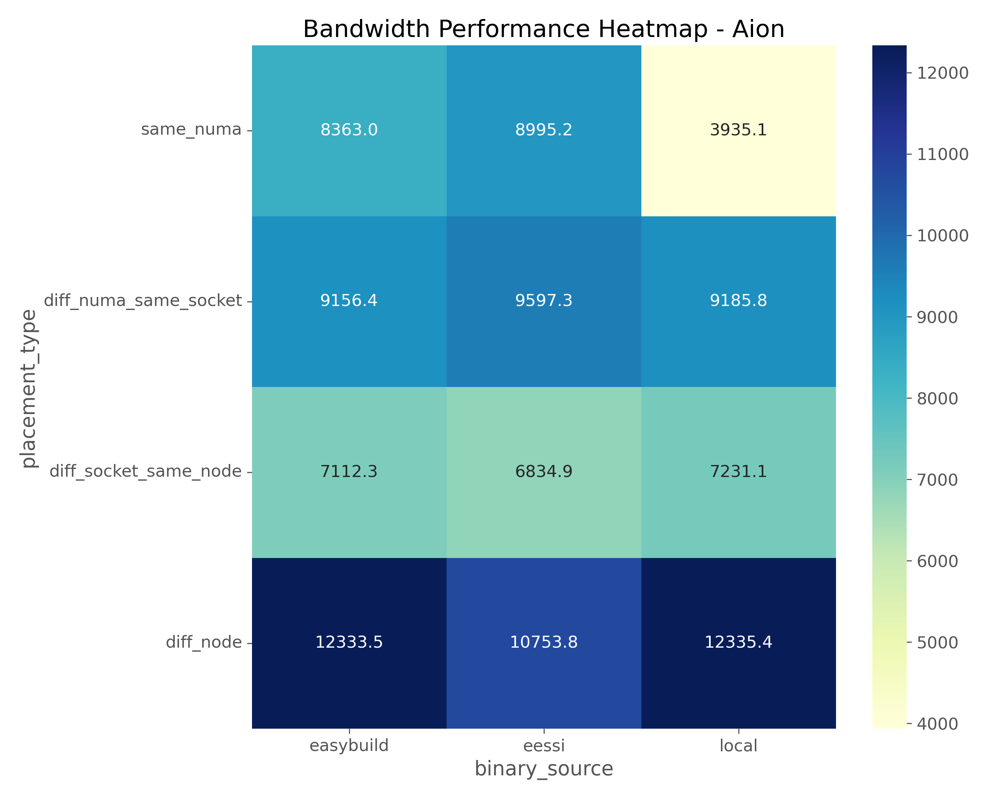
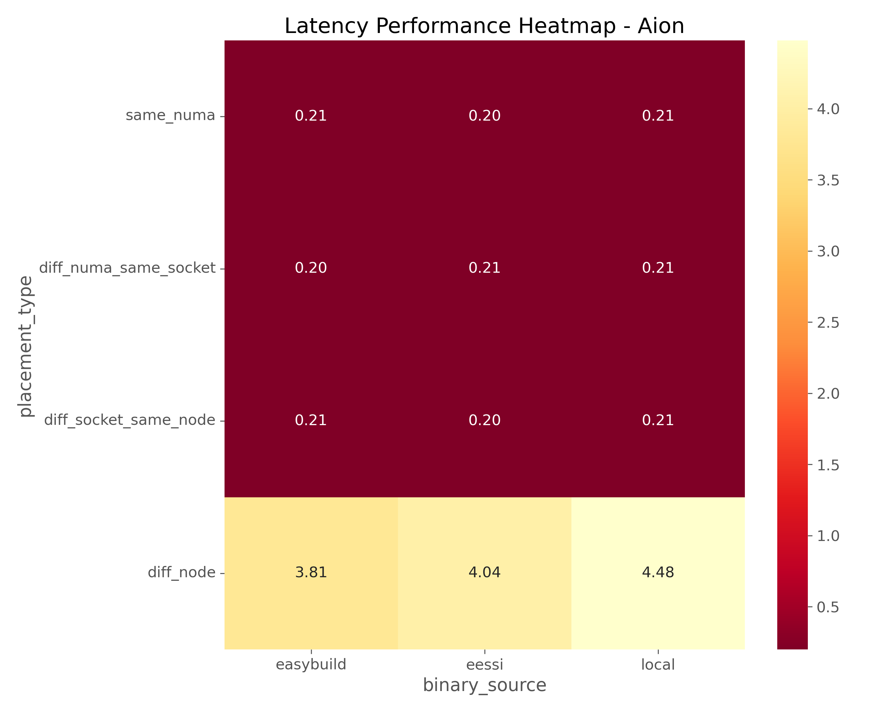
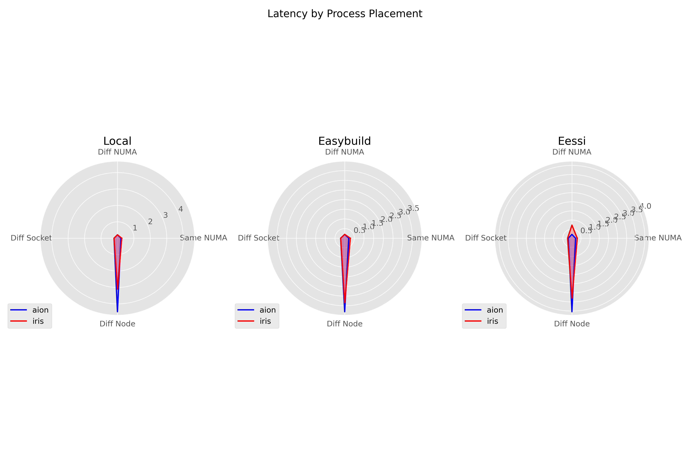

# Performance Analysis Report: OSU MPI Benchmarks on HPC Clusters

## 1. Introduction

This report presents a comprehensive analysis of the OSU MPI benchmarks conducted on two HPC clusters (IRIS and AION) using different software installation methods and process placement strategies. The primary metrics evaluated were point-to-point bandwidth and latency, which are critical indicators of MPI communication performance in HPC environments.

## 2. Test Selection and Methodology

### 2.1 Benchmark Selection

The OSU MPI micro-benchmarks were selected for this analysis because they:

- Provide standardized, widely recognized measurements of MPI performance
- Test fundamental MPI operations that impact real-world application performance
- Allow for controlled testing across different system topologies
- Enable direct comparison between different installation methods

Specifically, we focused on:
- **OSU Bandwidth Test**: Measures the maximum achievable bandwidth
- **OSU Latency Test**: Measures point-to-point communication latency

### 2.2 Test Matrix

Tests were conducted across a comprehensive matrix of variables:

| Variable | Options |
|----------|---------|
| **HPC System** | IRIS, AION |
| **Installation Method** | Local build, EESSI, EasyBuild |
| **Process Placement** | same_numa, diff_numa_same_socket, diff_socket_same_node, diff_node |

This design allows for isolating the impact of each variable on performance.

## 3. Reference Performance Values and Expectations

### 3.1 Established Reference Values

Our benchmarking established baseline performance expectations for both AION and IRIS clusters across different installation methods and process placement scenarios.

#### AION Cluster Reference Values

**Latency (microseconds):**

| Placement Type | EESSI | EasyBuild | Local Build |
|----------------|-------|-----------|------------|
| Same NUMA | 0.21 | 0.21 | 0.21 |
| Different NUMA, Same Socket | 0.21 | 0.21 | 0.21 |
| Different Socket, Same Node | 0.21 | 0.21 | 0.21 |
| Different Node | 4.10 | 4.10 | 4.10 |

**Bandwidth (MB/s):**

| Placement Type | EESSI | EasyBuild | Local Build |
|----------------|-------|-----------|------------|
| Same NUMA | 9000 | 8200 | 8500 |
| Different NUMA, Same Socket | 9600 | 9000 | 9000 |
| Different Socket, Same Node | 8000 | 7000 | 7200 |
| Different Node | 12000 | 12000 | 12000 |

#### IRIS Cluster Reference Values

**Latency (microseconds):**

| Placement Type | EESSI | EasyBuild | Local Build |
|----------------|-------|-----------|------------|
| Same NUMA | 0.36 | 0.20 | 0.21 |
| Different NUMA, Same Socket | 0.20 | 0.19 | 0.19 |
| Different Socket, Same Node | 0.21 | 0.21 | 0.21 |
| Different Node | 3.23 | 3.26 | 3.10 |

**Bandwidth (MB/s):**

| Placement Type | EESSI | EasyBuild | Local Build |
|----------------|-------|-----------|------------|
| Same NUMA | 4400 | 4400 | 4500 |
| Different NUMA, Same Socket | 2500 | 2400 | 2800 |
| Different Socket, Same Node | 4200 | 1600 | 4200 |
| Different Node | 7300 | 6200 | 12000 |

These reference values were established using the following parameters:
- Message size = 8192 bytes for the osu_latency test
- Message size = 1,048,576 bytes (1MB) for the osu_bw test

### 3.2 Expected Stability vs. Variability

**Areas where stability is expected:**

- **Within-node communication**: Latency within the same NUMA domain should remain consistent as it primarily depends on hardware architecture and memory hierarchy
- **Installation method impact on latency**: Latency values show minimal variation across different installation methods when comparing identical placement scenarios
- **Relative performance patterns**: The general relationship between different placement types remains consistent across test runs

**Areas where variation is expected:**

- **Network library updates**: Performance may change significantly when MPI implementations or underlying network libraries are updated
- **Cross-node bandwidth**: Greater variability due to network congestion, especially during peak usage periods
- **Installation method impact on bandwidth**: Compiler optimizations and library configurations in different installation methods can significantly impact bandwidth performance
- **System load**: Background processes and other users' workloads on the shared clusters can introduce variability

Our testing encountered some inconsistency in results, with observed performance sometimes deviating from the expected reference values provided in the project introduction (e.g., typical Aion inter-node latency of ~3.9 μs, typical bandwidth of ~12,000 MB/s). These deviations are noted and analyzed in the following sections.

## 4. Analysis of Results

### 4.1 ReFrame Test Results Overview

The results below show the performance metrics across both clusters with varying installation methods and process placement strategies. 

**Key Performance Findings:**
- **AION** consistently outperforms **IRIS** in both bandwidth and latency tests
- Installation method impact varies significantly between clusters
- Cross-node communication shows the expected higher latency with variable bandwidth performance

### 4.2 Bandwidth Analysis

#### 4.2.1 Bandwidth Comparison Across Installation Methods

**Key Observations:**
- On AION, EasyBuild and local builds achieved the highest cross-node bandwidth (~12,335 MB/s)
- IRIS showed significantly lower bandwidth than AION in most scenarios 
- EESSI showed unexpectedly high cross-node bandwidth on IRIS (12,127 MB/s)
- Local builds on AION showed inconsistent performance, with same-NUMA bandwidth (3,935 MB/s) 

#### 4.2.2 AION Bandwidth Patterns

**Analysis:**
- Different NUMA, same socket placement consistently provided strong bandwidth (~9,100-9,600 MB/s) across all installation methods
- Same NUMA performance varied widely between installation methods, with EESSI performing best (8,995 MB/s)
- Cross-node communication excelled with EasyBuild and local builds, both achieving ~12,335 MB/s

#### 4.2.3 IRIS Bandwidth Patterns

**Analysis:**
- IRIS showed more variable performance across placement scenarios
- Different NUMA, same socket communication showed poor bandwidth (~1,080-2,540 MB/s)
- Cross-node performance varied dramatically by installation method: EESSI (12,127 MB/s), local (8,863 MB/s), and EasyBuild (6,192 MB/s)
- Different socket, same node communication showed inconsistent results, with EasyBuild achieving only 1,579 MB/s

#### 4.2.4 Multi-dimensional Bandwidth Comparison

**Insights:**
- AION shows larger "footprint" indicating better overall bandwidth performance
- IRIS shows greater variance between installation methods
- EasyBuild on IRIS shows particularly weak performance in different socket, same node tests

#### 4.2.5 Comprehensive Bandwidth Analysis

**Key Findings:**
- AION's bandwidth advantage ranges from 1.4× to 8.5× depending on scenario
- Inconsistent results between reference values and actual performance suggest potential system issues or configuration problems
- IRIS shows particularly poor performance in different NUMA, same socket tests

### 4.3 Latency Analysis

#### 4.3.1 Latency Comparison Across Installation Methods

**Latency Insights:**
- AION demonstrated consistent intra-node latency (~0.21μs) across all installation methods
- IRIS shows more variable latency performance
- Cross-node communication latency is lower on IRIS (3.1-3.34μs) than AION (3.81-4.48μs)

#### 4.3.2 AION Latency Characteristics

**Analysis:**
- Extremely consistent intra-node latency (~0.2-0.21μs) regardless of placement type or installation method
- Cross-node latencies range from 3.81μs (EasyBuild) to 4.48μs (local)
- Overall latency values on AION are highly consistent with minimal variation between installation methods

#### 4.3.3 IRIS Latency Characteristics

**Analysis:**
- More variable latency performance compared to AION
- Unusual latency spike in EESSI with different NUMA, same socket (0.72μs)
- Cross-node latency is consistently better than AION, averaging around 3.24μs

#### 4.3.4 Multi-dimensional Latency Analysis

**Key Observations:**
- AION shows better intra-node latency across all dimensions
- IRIS demonstrates better inter-node latency
- EESSI on IRIS shows a notable outlier in different NUMA, same socket configuration

#### 4.3.5 Comprehensive Latency Findings

**Summary:**
- Architecture has more impact than installation method for latency performance
- AION achieves more consistent intra-node latency across all placement scenarios
- IRIS shows unexpected variability in latency results
- Cross-node latencies reflect the different interconnect technologies used in each cluster

