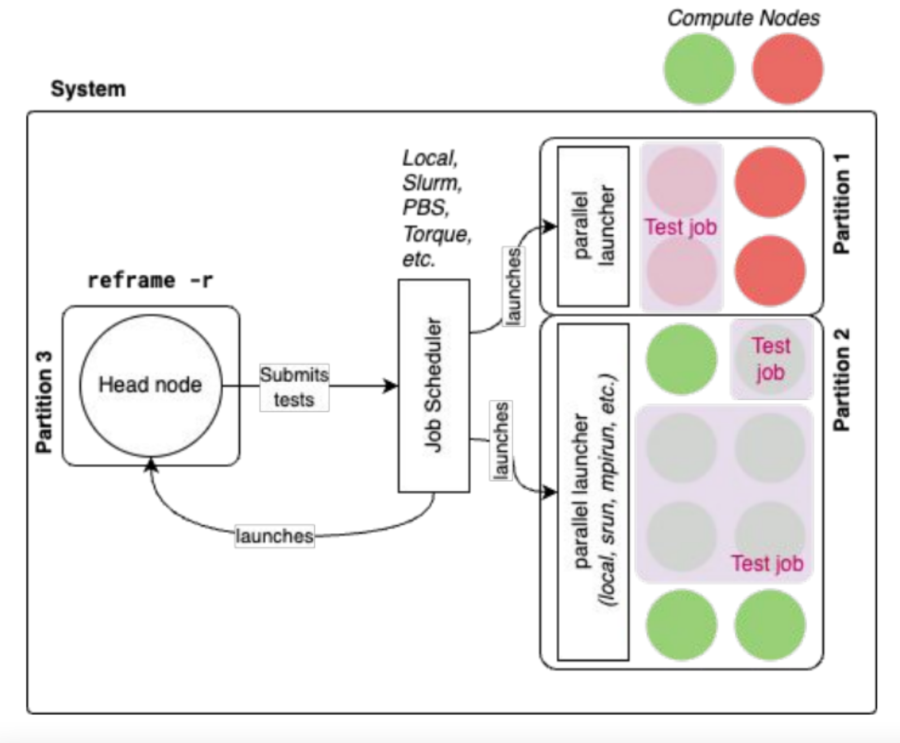
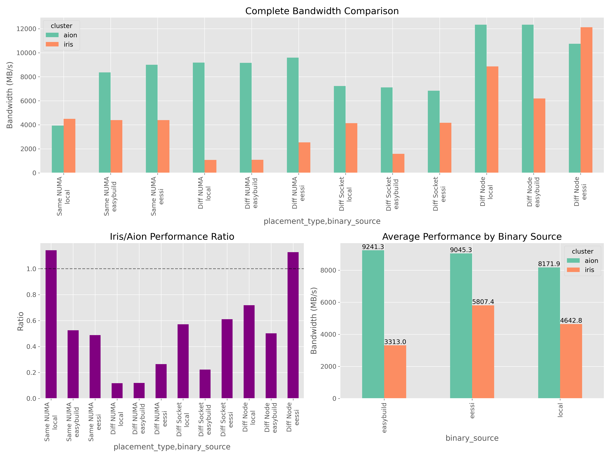

```{r setup, include=FALSE}
options(htmltools.dir.version = FALSE)
knitr::opts_chunk$set(warning = FALSE, message = FALSE)
```

```{css echo=FALSE}
.pull-left {
  float: left;
  width: 65%;
}
.pull-right {
  float: right;
  width: 35%;
}
.pull-right ~ p {
  clear: both;
}
```

# Outline.

- .maroon[Introduction]

- .maroon[Installation Methods]

- .maroon[Topology Analysis]

- .maroon[Manual Testing Approach]

- .maroon[Reframe Framework]

- .maroon[Performance Analysis]

---
class: title-slide

# Understanding MPI Communication Patterns
## Why, How, and What to Test in HPC Environments

---

# Why Test MPI Communication Patterns?
<style>
.container {
  display: flex;
  justify-content: space-between;
  gap: 2rem;
}

.left, .right {
  flex: 1;
}

.maroon {
  color: maroon;
}
</style>

<div class="container">
  <div class="left">
    <h2>Performance Bottlenecks</h2>
    <ul>
      <li>Communication often represents the <strong>primary bottleneck</strong> in HPC applications</li>
      <li>Different applications have distinct communication patterns and needs</li>
      <li><span class="maroon">System-specific</span> optimization requires targeted performance data</li>
    </ul>
  </div>

  <div class="right">
    <h2>Business Impact</h2>
    <ul>
      <li>Inefficient communication can waste expensive compute resources</li>
      <li>Optimized communication patterns can <span class="maroon">reduce time-to-solution</span> by orders of magnitude</li>
      <li>Understanding performance characteristics enables better application design</li>
    </ul>
  </div>
</div>

--
## Standard: OSU Micro-Benchmarks (OMB)
- Widely accepted performance testing suite for MPI implementations
- Offers comprehensive testing of .maroon[point-to-point] and .maroon[collective] operations
- Enables standardized comparison across different systems and configurations

---

# How We Test: Methodologies
<div style="display: flex; gap: 2em; align-items: flex-start; justify-content: space-between;">

  <div style="flex: 1;">
    <h2>Systematic Benchmarking</h2>
    <ul>
      <li><strong>SLURM Job Scheduler</strong>
        <ul>
          <li><span style="color: maroon;">Precise process placement</span> through CPU binding</li>
          <li>Controlled testing environment parameters</li>
          <li>Reproducible execution conditions</li>
        </ul>
      </li>
      <li><strong>Topology-Aware Testing</strong>
        <ul>
          <li>NUMA domain awareness</li>
          <li>Socket-level process placement</li>
          <li>Cross-node communication patterns</li>
        </ul>
      </li>
    </ul>
  </div>

  <div style="flex: 1;">
    <h2>Automated Testing</h2>
    <ul>
      <li><strong>ReFrame Framework</strong>
        <ul>
          <li><span style="color: maroon;">Python-based</span> test definitions</li>
          <li>Parametrized test execution</li>
          <li>Systematic result collection</li>
        </ul>
      </li>
      <li><strong>Benefits of Automation</strong>
        <ul>
          <li>Eliminates human error</li>
          <li>Enables large-scale test campaigns</li>
          <li>Facilitates cross-platform comparisons</li>
        </ul>
      </li>
    </ul>
  </div>

</div>


---

# What We Test: Key Performance Metrics
<div class="comparison-container">
  <div class="column">
    <h2>Bandwidth</h2>
    <ul>
      <li><strong>Definition</strong>: Maximum throughput (GB/s)</li>
      <li><strong>Analogy</strong>: Width of a highway</li>
      <li><strong>Impact</strong>: Critical for bulk data transfers</li>
      <li><strong>Example</strong>: A 2× bandwidth improvement can reduce large dataset transfer times from hours to minutes</li>
    </ul>    
    <h2>Latency</h2>
    <ul>
      <li><strong>Definition</strong>: Message delivery time (μs)</li>
      <li><strong>Analogy</strong>: Travel time between points</li>
      <li><strong>Impact</strong>: Crucial for iterative algorithms</li>
      <li><strong>Example</strong>: Even microsecond improvements matter in tightly-coupled simulations</li>
    </ul>
  </div>

  <div class="column">
    
    
  </div>
</div>
<style>
  .comparison-container {
    display: flex;
    justify-content: space-between;
  }
  .column {
    width: 50%;
  }
  .column img {
    max-width: 80%;
    height: auto;
  }
</style>

---

class: title-slide

# Installation Methods
## Comparing Approaches to MPI Deployment

---

# MPI Installation Approaches Compared


### (European Environment for Scientific Software Installations)
- .maroon[Compatibility layer] across diverse HPC systems
- Pre-optimized scientific software stack with consistent environment
- Container-based deployment model for portability

--

### EasyBuild
- .maroon[Automated build framework] for scientific software
- Module-based software management with version control
- Comprehensive dependency resolution and conflict management

--

### Local Installation
- .maroon[Custom-built for specific hardware]
- Tailored compiler optimizations
- Direct integration with system libraries
- Maximum performance potential

---

class: title-slide

# Architecture Analysis
---
### Fundamental Components
- Physical Node
  - A complete physical server or computer system
  - Examples:
    - **AION**: A server with 2 AMD EPYC 7742 processors (128 cores total)
    - **IRIS**: A server with 2 Intel Xeon Gold 6148 processors (40 cores total)
--

- Socket
  - A physical connector on the motherboard that houses a CPU
  - Both example servers are dual-socket systems (contain 2 physical CPUs)
  - Each socket contains one multi-core processor chip
--

- NUMA Node
  - NUMA = Non-Uniform Memory Access
  - A processing unit with its own dedicated local memory
  - Memory access is faster within the same NUMA node than across nodes

--

- Core
  - An independent processing unit within a CPU
  - Modern processors contain multiple cores for parallel processing
  - In the examples: AMD EPYC has 64 cores per processor, Intel Xeon has 20

---
# cluster Architecture 

### **AION**
- **Aion** is a cluster of x86-64 AMD-based compute nodes.
- Consists of 354 "regular" computational nodes
  

```{bash, echo=TRUE, eval=FALSE}
Single node configuration:
- 8 NUMA node.
- 2 socket.
- Socket 0: NUMA nodes 0 1 2 3
- Socket 1: NUMA nodes 4 5 6 7
CPU mapping belonging to:
- NUMA node 0: CPUs 0 1 2 3 4 5 6 7 8 9 10 11 12 13 14 15
- NUMA node 1: CPUs 16 17 18 19 20 21 22 23 24 25 26 27 28 29 30 31
- NUMA node 2: CPUs 32 33 34 35 36 37 38 39 40 41 42 43 44 45 46 47
- NUMA node 3: CPUs 48 49 50 51 52 53 54 55 56 57 58 59 60 61 62 63
- NUMA node 4: CPUs 64 65 66 67 68 69 70 71 72 73 74 75 76 77 78 79
- NUMA node 5: CPUs 80 81 82 83 84 85 86 87 88 89 90 91 92 93 94 95
- NUMA node 6: CPUs 96 97 98 99 100 101 102 103 104 105 106 107 108 109 110 111
- NUMA node 7: CPUs 112 113 114 115 116 117 118 119 120 121 122 123 124 125 126 127
```

---
# cluster Architecture 

### **IRIS**
- **IRIS** is a cluster of x86-64 Intel-based compute nodes.
-  consists of 196 computational nodes named `iris-[001-196]`
-  Regular (Broadwell) Nodes are `iris-[001-108]`
  

```{bash, echo=TRUE, eval=FALSE}
Single node configuration:
- 2 NUMA node
- 2 socke
- Socket 0: NUMA nodes 0
- Socket 1: NUMA nodes 1
CPU mapping belonging to:
- NUMA node 0: CPUs 0 2 4 6 8 10 12 14 16 18 20 22 24 26
- NUMA node 1: CPUs 1 3 5 7 9 11 13 15 17 19 21 23 25 27
```

---


class: title-slide

# Manual Testing Approach

---

## SLURM Configuration Options

- `-n`: Number of processes to run
  - Controls MPI task count

--

- `-N`: Number of nodes to allocate
  - Determines inter-node vs intra-node communication patterns

--

- `-c`: CPU cores per task
  - Affects process density and resource allocation

--

- `--cpu_bind`: Process binding strategy
  - `mask_cpu`: Explicit CPU mask for precise process placement
  - Critical for controlling NUMA and socket-level process distribution

--

- `numactl`: NUMA control utility
  - Memory and CPU affinity management
  - Complements SLURM's placement capabilities

---

### Verification of CPU, Socket, and NUMA binding after placement

 
```{bash, echo=TRUE, eval=FALSE}
    srun $NODE_ARGS -n 2 $BIND_ARGS bash -c '
        CPU=$(taskset -cp $BASHPID | awk -F: "{print \$2}" | tr -d " ")
        TOPOLOGY=$(lscpu -p=cpu,socket,node | grep "^$CPU,")
        SOCKET=$(echo $TOPOLOGY | cut -d, -f2)
        NUMA=$(echo $TOPOLOGY | cut -d, -f3)
        NODE=$(hostname)
        echo "Task $SLURM_PROCID on Node $NODE: CPU $CPU, Socket $SOCKET, NUMA node $NUMA"
    ' | tee -a "$OUTPUT_FILE"```
```

- `taskset -cp $BASHPID`: Shows the CPU affinity of the current shell.

- `lscpu -p=cpu,socket,node | grep "^$CPU,`: Gets the socket and NUMA node info for the CPU affinity obtained in the previous command.

---
# Test Case 1: Same NUMA Node

- Communication within single NUMA domain
- Lowest expected latency, highest bandwidth
  
```{bash, echo=TRUE, eval=FALSE}
srun -N 1 -n 2 --cpu-bind=map_cpu:0,4 osu_get_latency
```

- Task 0 on : CPU(s) 0, Socket 0, NUMA node 0
- Task 1 on : CPU(s) 4, Socket 0, NUMA node 0
  
# Test Case 2: Cross-NUMA, Same Socket

- Communication across NUMA boundaries
- Memory controller traversal overhead
   
```{bash, echo=TRUE, eval=FALSE}
srun srun -N 1 -n 2 --cpu-bind=map_cpu:0,16 osu_get_latency
```

- Task 1 on : CPU(s) 16, Socket 0, NUMA node 1
- Task 0 on : CPU(s) 0, Socket 0, NUMA node 0

<!-- .center[] -->

---

# Test Case 3: Cross-Socket

- Communication between CPU sockets
- Higher latency due to QPI/UPI interconnect
  
```{bash, echo=TRUE, eval=FALSE}
srun -N 1 -n 2 --cpu-bind=map_cpu:0,64 osu_get_latency
```
- Task 0 on : CPU(s) 0, Socket 0, NUMA node 0
- Task 1 on : CPU(s) 64, Socket 1, NUMA node 4
<!-- .center[] -->

<!-- --- -->

# Test Case 4: Cross-Node

- Network-based communication
- Higher latency, Higher bandwidth.

```{bash, echo=TRUE, eval=FALSE}
srun -N 2 -n 2 -c 1 --cpu-bind=cores osu_get_latency
```

- Task 1 on Node **cluster - ## :** CPU(s) 0, Socket 0, NUMA node 0
- Task 0 on Node **cluster - @@ :** CPU(s) 0, Socket 0, NUMA node 0
  
<!-- .center[] -->
---


class: title-slide

# Manual placement result Analysis

---
### Manual Test Results Overview : Observations 1 
.pull-left[


]

.pull-right[
### Key Findings
- **AION** outperforms **IRIS** in both bandwidth(intra-node) and latency tests
  
- **AION** Bandwidth achieved 8000 +/- MB's for intra node
  
- **IRIS** Bandwidth achieved 4000 +/- MB's for intra node
  
- **Cross-node** communication shows expected higher latency for both clusters, around 12000 +/- MB's
]

---
### Manual Test Results Overview : Observations 2 
.pull-left[


]

.pull-right[
### Key Findings
- Most of times **Local** installation leads to low bandwidth for Inter-node communication in both of clusters **AION** **IRIS** .
- Need to find out the cases ???
- 
]


---
### Bandwidth overview in detail

<div style="text-align: center;">
  
  <p><em>Figure: Comparison of bandwidth performance across Aion and Iris with local placement.</em></p>
</div>

---

class: title-slide

# ReFrame Framework
## Automating HPC Performance Testing

---

# ReFrame Implementation Overview
.pull-left[



]

.pull-right[
### Key Components
- **Test configuration** (scales and structure)
- **Job specifications** (resource boundaries)
- **Launch parameters** (execution control)
- **Verification mechanisms** (result validation)

### Framework Benefits
- Systematic performance testing across multiple systems
- Python-based test definitions for flexibility
- Built-in validation and result reporting
- Reproducible test environments
]

---

# ReFrame Configuration Hierarchy

## Test Configuration Parameters
- `self.num_tasks`: Number of computational processes
- `self.num_nodes`: Number of physical compute nodes
- `self.num_tasks_per_node`: Process distribution

## Job Resource Parameters
```python
self.job.options = ['-N 1 -n 2 --exclusive']  # Resource allocation
```


## Process Execution Controls
```python
self.job.launcher.options = [  # How processes run
    'SRUN_OPTIONS',           
    './binding_script.sh'     # Custom binding control
]
```
---

# Hardware-Aware Process Binding

## NUMA Topology Mapping
```python
# Socket to NUMA node mapping
SOCKET_NUMA_MAP[0]="0 1 2 3"  # First socket contains 4 NUMA domains
SOCKET_NUMA_MAP[1]="4 5 6 7"  # Second socket contains 4 NUMA domains

# Key binding targets
NUMA_SAME=0                  # Same NUMA node
NUMA_DIFF_SAME_SOCKET_1=0    # Different NUMA, same socket (first)
NUMA_DIFF_SAME_SOCKET_2=1    # Different NUMA, same socket (second)
NUMA_DIFF_SOCKET_1=0         # Different socket (first)
NUMA_DIFF_SOCKET_2=4         # Different socket (second)
```

## Binding Mechanisms
- `numactl` for NUMA-aware process and memory placement
- `--cpunodebind` and `--membind` for CPU and memory affinity

---

# Placement Verification Strategy

## Multi-layered Verification
- Post-execution process placement checks
- Hardware topology validation
- Actual vs. requested binding confirmation


```{python, echo=TRUE, eval=FALSE}
tmp_str = '--cpu-bind=verbose,map_cpu:0,64'
self.postrun_cmds = [
      'echo "==== Detailed Process Placement Verification (after benchmark) ===="',
      f'srun -n2 {tmp_str} bash -c \'echo "TASK $SLURM_PROCID on $(hostname): CPU $(taskset -cp $$), NUMA node $(cat /proc/self/status | grep Mems_allowed_list | cut -f2), Socket $(lscpu -p=cpu,socket | grep "^$(taskset -cp $$ | grep -o "[0-9]*$")," | cut -d, -f2)"\'',
      'echo "==== Verifying process placement ===="',
      f'srun -n2 {tmp_str} ./hw-detect.sh --verify'
  ]
```


## Why Verification Matters
- Ensures reproducible benchmark conditions
- Validates topology-aware placement
- Helps diagnose performance anomalies


---

# Test Case 1: Same NUMA 

## Implementation Strategy
- Place processes on same NUMA domains within same node

```{python, echo=TRUE, eval=FALSE}          
self.num_nodes           = 1               
self.num_tasks_per_socket= 2          
self.num_tasks_per_node  = 2      
self.num_tasks           = 2
self.num_cpus_per_task   = 1

SRUN_OPTIONS = '-N 1 -c 1 -n 2 --ntasks-per-socket 2 --distribution=block:block:block'
    
self.job.launcher.options = [    
    SRUN_OPTIONS,           
    './bind_same_numa.sh'
]
```

```{bash, echo=TRUE, eval=FALSE}
#!/bin/bash
# Bind both processes to the same NUMA node
source $(dirname $0)/binding_vars.sh
# Use the same NUMA for both processes
BINDING_NODE=$NUMA_SAME
echo "Binding all processes to NUMA node $BINDING_NODE"
numactl --cpunodebind=$BINDING_NODE "$@"    
```

---

## Verification Results
```{bash, echo=TRUE, eval=FALSE}
Case same NUMA; Binding all processes to NUMA node 5
Case same NUMA; Binding all processes to NUMA node 5
==== Detailed Process Placement Verification (after benchmark) ====
TASK 0 on aion-0165: CPU pid 1964369's current affinity list: 81, NUMA node 0-7, Socket 1
TASK 1 on aion-0165: CPU pid 1964370's current affinity list: 82, NUMA node 0-7, Socket 1
==== Verifying process placement ====
==== Task 0 placement ====
==== Task 1 placement ====
Running on host: aion-0165
Running on host: aion-0165
NUMA binding: nodebind: 5 
membind: 0 1 2 3 4 5 6 7 
NUMA binding: nodebind: 5 
membind: 0 1 2 3 4 5 6 7 
CPUs: 81
CPUs: 82
Socket: 1
Socket: 1
NUMA node: 5
NUMA node: 5
Core: 81
============================
Core: 82
============================
```

---
# Test Case 2: Cross-NUMA 

## Implementation Strategy
- Place processes on different NUMA domains within same socket

```{python, echo=TRUE, eval=FALSE}                   
self.job.options = ['-N 1 -n 2 --exclusive']
SRUN_OPTIONS = '-N1 -n2 -c1 --distribution=cyclic'
self.job.launcher.options = [    
    SRUN_OPTIONS,           
    './bind_diff_numa_same_socket.sh'
]        
tmp_str = '--cpu-bind=verbose,map_cpu:0,16'
```


```{bash, echo=TRUE, eval=FALSE}
#!/bin/bash
# Bind processes to different NUMA nodes on the same socket
source $(dirname $0)/binding_vars.sh
# Apply binding based on task ID
if [ "$SLURM_PROCID" = "0" ]; then
    echo "Task 0: Binding to NUMA node $NUMA_DIFF_SAME_SOCKET_1"
    numactl --cpunodebind=$NUMA_DIFF_SAME_SOCKET_1 --membind=$NUMA_DIFF_SAME_SOCKET_1 "$@"
else
    echo "Task 1: Binding to NUMA node $NUMA_DIFF_SAME_SOCKET_2"
    numactl --cpunodebind=$NUMA_DIFF_SAME_SOCKET_2 --membind=$NUMA_DIFF_SAME_SOCKET_2 "$@"
fi      
```

---

## Verification Results
```{bash, echo=TRUE, eval=FALSE}
Case different NUMA same socket; Task 0: Binding to NUMA node 0
Case different NUMA same socket; Task 1: Binding to NUMA node 1
==== Detailed Process Placement Verification (after benchmark) ====
TASK 0 on aion-0232: CPU pid 499802's current affinity list: 0, NUMA node 0-7, Socket 0
TASK 1 on aion-0232: CPU pid 499803's current affinity list: 16, NUMA node 0-7, Socket 0
==== Verifying process placement ====
==== Task 0 placement ====
==== Task 1 placement ====
Running on host: aion-0232
Running on host: aion-0232
NUMA binding: nodebind: 1 
membind: 0 1 2 3 4 5 6 7 
NUMA binding: nodebind: 0 
membind: 0 1 2 3 4 5 6 7 
CPUs: 16
CPUs: 0
Socket: 0
Socket: 0
NUMA node: 1
NUMA node: 0
Core: 16
============================
Core: 0
============================
```
---

# Test Case 3: Cross-Socket 


```{python, echo=TRUE, eval=FALSE}
self.job.options = ['-N 1 -n 2 --exclusive']                
SRUN_OPTIONS = '-N1 -n2 --ntasks-per-socket 1'                    
self.job.launcher.options = [    
    SRUN_OPTIONS,
    './bind_diff_socket.sh'
]
tmp_str = '--cpu-bind=verbose,map_cpu:0,64' 
```

```{bash, echo=TRUE, eval=FALSE}
#!/bin/bash
# Bind processes to different sockets
source $(dirname $0)/binding_vars.sh

# Apply binding based on task ID
if [ "$SLURM_PROCID" = "0" ]; then
    echo "Task 0: Binding to NUMA node $NUMA_DIFF_SOCKET_1"
    numactl --cpunodebind=$NUMA_DIFF_SOCKET_1 --membind=$NUMA_DIFF_SOCKET_1 "$@"
else
    echo "Task 1: Binding to NUMA node $NUMA_DIFF_SOCKET_2"
    numactl --cpunodebind=$NUMA_DIFF_SOCKET_2 --membind=$NUMA_DIFF_SOCKET_2 "$@"
fi            
```
---

## Verification Results
```{bash, echo=TRUE, eval=FALSE}
Case different socket; Task 1: Binding to NUMA node 4
Case different socket; Task 0: Binding to NUMA node 0
==== Detailed Process Placement Verification (after benchmark) ====
TASK 1 on aion-0234: CPU pid 4090397's current affinity list: 64, NUMA node 0-7, Socket 1
TASK 0 on aion-0234: CPU pid 4090396's current affinity list: 0, NUMA node 0-7, Socket 0
==== Verifying process placement ====
==== Task 0 placement ====
==== Task 1 placement ====
Running on host: aion-0234
Running on host: aion-0234
NUMA binding: nodebind: 4 
membind: 0 1 2 3 4 5 6 7 
NUMA binding: nodebind: 0 
membind: 0 1 2 3 4 5 6 7 
CPUs: 64
CPUs: 0
Socket: 1
Socket: 0
NUMA node: 4
NUMA node: 0
Core: 64
============================
Core: 0
============================
```
---

# Test Case 4: Cross-Node 

- Multi-node test orchestration
- Network topology awareness

```{python, echo=TRUE, eval=FALSE}
self.num_nodes           = 2
self.num_tasks_per_node  = 1     
self.num_tasks           = 2
self.num_cpus_per_task   = 1
            
self.job.launcher.options = [
    '--distribution=cyclic',
]
```
---

## Verification Results
```{bash, echo=TRUE, eval=FALSE}
==== Detailed Process Placement Verification (after benchmark) ====
TASK 0 on aion-0163: CPU pid 1642125's current affinity list: 2, NUMA node 0-7, Socket 0
TASK 1 on aion-0165: CPU pid 1964056's current affinity list: 81, NUMA node 0-7, Socket 1
==== Verifying process placement ====
==== Task 0 placement ====
Running on host: aion-0163
NUMA binding: nodebind: 0 
membind: 0 1 2 3 4 5 6 7 
CPUs: 2
Socket: 0
NUMA node: 0
Core: 2
============================
==== Task 1 placement ====
Running on host: aion-0165
NUMA binding: nodebind: 5 
membind: 0 1 2 3 4 5 6 7 
CPUs: 81
Socket: 1
NUMA node: 5
Core: 81
============================
```

---

# ReFrame Testing Flow Summary
.pull-left[

]

.pull-right[
### Systematic Approach Benefits
1. **Consistency** - Same tests across systems and configurations
2. **Precision** - Hardware-aware process placement
3. **Reproducibility** - Verification ensures test validity
4. **Scalability** - From single-node to multi-node scenarios
]

---
class: title-slide

# Performance Analysis

---
# Reference Values and Expectations

.pull-left[
### AION Cluster Reference Values
**Latency (μs)** with 8192 bytes message size

| Placement Type | EESSI | EasyBuild | Local |
|----------------|-------|-----------|-------|
| Same NUMA | 0.21 | 0.21 | 0.21 |
| Diff NUMA | 0.21 | 0.21 | 0.21 |
| Diff Socket | 0.21 | 0.21 | 0.21 |
| Diff Node | 4.10 | 4.10 | 4.10 |

**Bandwidth (MB/s)** with 1,048,576 bytes (1MB)

| Placement | EESSI | EasyBuild | Local |
|-----------|-------|-----------|-------|
| Same NUMA | 9000 | 8200 | 8500 |
| Diff NUMA | 9600 | 9000 | 9000 |
| Diff Socket | 8000 | 7000 | 7200 |
| Diff Node | 12000 | 12000 | 12000 |

]

.pull-right[
### Stability vs. Variability

**Stable Metrics**
- Intra-node latency (hardware-dependent)
- Relative performance patterns across placements
- Installation method impact on latency

**Variable Metrics**
- .maroon[Network library updates] can significantly change performance
- .maroon[Cross-node bandwidth] due to network congestion
- .maroon[System load] from other users' workloads
- Installation method impact on bandwidth
  
]

---


# ReFrame Test Results Overview

.pull-left[


]

.pull-right[
### Key Performance Findings
- **AION** consistently outperforms **IRIS** in both bandwidth and latency tests
- Installation method impact varies significantly between clusters
- Cross-node communication shows expected variable bandwidth
]
---

# Bandwidth Comparison with Different Installation Methods - ReFrame
.pull-left[


]

.pull-right[
### Key Observations
- On AION, EasyBuild and local builds achieved highest cross-node bandwidth (~12,335 MB/s)
- IRIS showed significantly lower bandwidth than AION in most scenarios
- EESSI showed unexpectedly high cross-node bandwidth on IRIS (12,127 MB/s)
- Local builds on AION showed inconsistent performance in same-NUMA tests
]

---

# Bandwidth Heatmap on AION - ReFrame
.pull-left[


]

.pull-right[
### AION Bandwidth Patterns
- Different NUMA, same socket placement consistently provided strong bandwidth (~9,100-9,600 MB/s)
- Same NUMA performance varied widely between installation methods, with EESSI performing best (8,995 MB/s)
- Cross-node communication excelled with EasyBuild and local builds, both achieving ~12,335 MB/s
]

---

## Bandwidth Heatmap on IRIS - ReFrame

.pull-left[


]

.pull-right[
### IRIS Bandwidth Patterns
- More variable performance across placement scenarios
- Different NUMA, same socket communication showed poor bandwidth (~1,080-2,540 MB/s)
- Cross-node performance varied dramatically by installation method: EESSI (12,127 MB/s), local (8,863 MB/s), EasyBuild (6,192 MB/s)
- Different socket tests showed inconsistent results, with EasyBuild achieving only 1,579 MB/s
]

---

# Bandwidth Radar Plot - ReFrame

.pull-left[


]

.pull-right[
### Multi-dimensional Comparison
- AION shows larger "footprint" indicating better overall bandwidth performance
- IRIS shows greater variance between installation methods
- EasyBuild on IRIS shows particularly weak performance in different socket, same node tests
]

---

# Bandwidth Comprehensive Comparison - ReFrame
.pull-left[



]

.pull-right[
### Comprehensive Analysis
- AION's bandwidth advantage ranges from 1.4× to 8.5× depending on scenario
- Inconsistent results suggest potential system issues or configuration problems
- IRIS shows particularly poor performance in different NUMA, same socket tests
]

---

# Latency Comparison with Different Installation Methods - ReFrame
.pull-left[


]

.pull-right[
### Latency Insights
- AION demonstrated consistent intra-node latency (~0.21μs) across all installation methods
- IRIS shows more variable latency performance
- Cross-node communication latency is lower on IRIS (3.1-3.34μs) than AION (3.81-4.48μs)
]


---

# Latency Heatmap on AION - ReFrame
.pull-left[


]

.pull-right[
### AION Latency Characteristics
- Extremely consistent intra-node latency (~0.2-0.21μs) regardless of placement or installation method
- Cross-node latencies range from 3.81μs (EasyBuild) to 4.48μs (local)
- Overall latency values highly consistent with minimal variation between installation methods
]

---

# Latency Heatmap on IRIS - ReFrame
.pull-left[


]

.pull-right[
### IRIS Latency Characteristics
- More variable latency performance compared to AION
- Unusual latency spike in EESSI with different NUMA, same socket (0.72μs)
- Cross-node latency consistently better than AION, averaging around 3.24μs
]


---

# Latency Radar Plot - ReFrame
.pull-left[


]

.pull-right[
### Multi-dimensional Latency Analysis
- AION shows better intra-node latency across all dimensions
- IRIS demonstrates better inter-node latency
- EESSI on IRIS shows a notable outlier in different NUMA, same socket configuration
]

---

# Latency Comprehensive Comparison - ReFrame
.pull-left[


]

.pull-right[
### Key Latency Findings
- Architecture has more impact than installation method for latency performance
- AION achieves more consistent intra-node latency across all placement scenarios
- IRIS shows unexpected variability in latency results
- Cross-node latencies reflect different interconnect technologies in each cluster
]

---

# Conclusions

## Performance Analysis Summary
- **Installation Impact**: Varies significantly between clusters and placement scenarios
- **Architectural Differences**: AION outperforms IRIS in bandwidth, but IRIS shows better cross-node latency
  - Bandwidth: Up to 8.5× higher on AION in some scenarios
  - Intra-node latency: More consistent on AION
  
--

## Practical Implications
- **Application-specific considerations**:
  - Cross-node bandwidth-sensitive applications perform best with EasyBuild/local on AION, EESSI on IRIS
  - Latency-sensitive applications that communicate across nodes may benefit from IRIS architecture
  - Process placement remains critical regardless of installation method  

---

class: title-slide

# Thank you!
## Questions?

---

